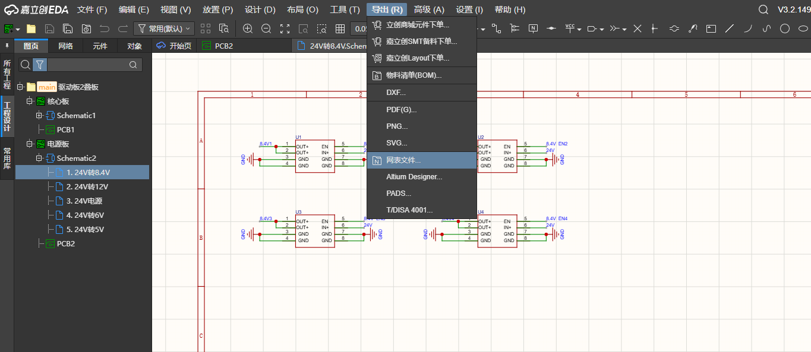
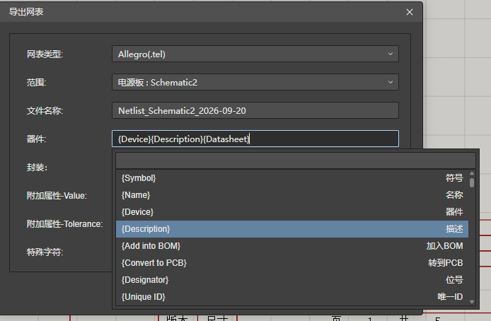
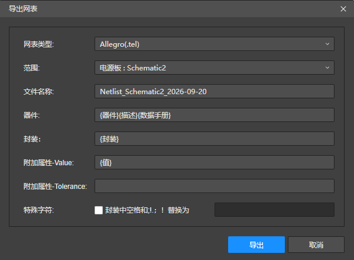

# -skill

嘉立创EDA 原理图检查 skill（适用于 Codex）。

## 这是什么

[schematic-reviewer](schematic-reviewer/) 是一个原理图检查与审核 skill：读芯片数据手册做逐引脚分析，检查去耦、上拉、匹配等外围电路是否缺失或参数错误，识别大电流路径并按 IPC-2221 计算走线宽度，通过立创/JLC 接口核实元器件规格（耐压、额定电流、封装）与现货库存。

## 使用步骤（嘉立创EDA 导出网表 → Codex 检查）

### 第 1 步：在原理图界面点击导出

打开嘉立创EDA 的原理图，点击顶部菜单「导出(R)」→「网表文件...」。

### 第 2 步：选择需要的信息

在弹出的「导出网表」窗口中：

- 网表类型：Allegro(.tel)
- 范围：选择要检查的原理图（如 `电源板 : Schematic2`）
- 器件：建议**只保留「器件 {Device}」「描述 {Description}」「数据手册 {Datasheet}」三项**，即 `{Device}{Description}{Datasheet}`；封装、附加属性（Value/Tolerance）等无需勾选

在「器件」输入框中选择这三个字段：

确认器件栏显示为「(器件)(描述)(数据手册)」后，点击「导出」，保存生成的 .tel 网表文件：

### 第 3 步：把文件地址发给 AI

将导出的网表文件完整路径（文件地址）发送给 Codex。

### 第 4 步：使用 skill 检查原理图

让 Codex 调用 `schematic-reviewer` skill 检查这份网表，即可得到外围电路、载流走线加宽、元器件选型与库存等方面的问题清单。

## 目录说明

- [schematic-reviewer/](schematic-reviewer/) — skill 本体
  - `SKILL.md`：主流程与约束
  - `agents/openai.yaml`：界面元数据
  - `scripts/lcsc_lookup.py`：立创/JLC 元器件规格与库存查询
  - `scripts/trace_width.py`：IPC-2221 走线载流计算
  - `references/`：外部 checklist 索引、立创接口用法、外围电路规则、载流速查表
- `docs/images/`：使用步骤操作截图

## 环境要求

- Codex（本 skill 为 Codex skill 格式）
- Python 3.8+，脚本仅依赖标准库
- 可访问 `jlcpcb.com`（元器件接口）与厂商数据手册站点
